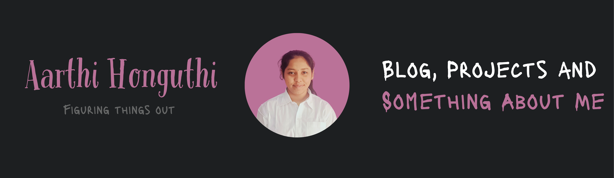

<!-- 
Aarthi Honguthi | GitHub Profile README 
Personal, authentic, and in-progress. 
-->

# Hey there! 

I'm **Aarthi Honguthi** — a CS undergrad at ABV-IIITM, passionate about full-stack development, distributed systems, and serverless tech, with a curious eye on AI/ML.
Most of what I know came from hours of docs, errors I didn’t understand at first, and the thrill of finally making something click.

> 🤝 Yesterday’s doubts. Today’s grind. Tomorrow’s story.

---

## 🛠 Tech Stack I’m Working With

**Languages**:  

**Frontend / UI**:  

**Backend / Server**:  

**Database / ORM**:  

**Cloud / Tools**:  

---

## Blog, Projects, and a Bit About Me

I ~~regularly~~ write articles on [Medium](https://medium.com/@aarthihonguthi025)

<!-- BLOG-POST-LIST:START -->
- [The Placement Grind](https://medium.com/@aarthihonguthi025/the-placement-grind-880ad289ca6a?source=rss-f9d595f61959------2)
- [From Idea to App Store: Your Blueprint for Building Any Tech Project](https://medium.com/@aarthihonguthi025/from-idea-to-app-store-your-blueprint-for-building-any-tech-project-ce16785cb4da?source=rss-f9d595f61959------2)
- [GEN AI vs AI AGENTS vs AGENTIC AI](https://medium.com/@aarthihonguthi025/gen-ai-vs-ai-agents-vs-agentic-ai-2255bd671d0f?source=rss-f9d595f61959------2)
- [Understanding Binding in Programming](https://medium.com/@aarthihonguthi025/understanding-binding-in-programming-eb9a15be49d4?source=rss-f9d595f61959------2)
- [Object Oriented Programming with C++ &lpar;Part- 1&rpar;](https://blog.devgenius.io/object-oriented-programming-with-c-part-1-a498837229e4?source=rss-f9d595f61959------2)
<!-- BLOG-POST-LIST:END -->

Portfolio: [aarthihonguthi.github.io/portfolio2.O](https://aarthihonguthi.github.io/portfolio2.O/)

Member of [**Uthaan**](https://www.youtube.com/c/UthaanIIITM), our campus journalism club — we run HYP (How You Got Placed) series and the cool Fresher's Video is shot by us  

A few fun projects:
-  **Smart Chatbot** – Automated food ordering with FastAPI, Dialogflow, MySQL
-  **FlowForge** – Zapier-style microservice platform (Kafka + Solana + Prisma + Next.js)
-  **Medico** – Flask-based AI health assistant with appointment booking
-  **Personal AI Portfolio** – Astro + Gemini API + markdown blogging engine

So this is all about my projects and contributions.  
**Wondering what my problem-solving skills are like?**  
Check out my [LeetCode profile](https://leetcode.com/u/Aarthi_025/)

---

## GitHub Stats

 

---

## Connect With Me

---

> “Building projects, breaking limits, becoming me.”  
> — Aarthi
